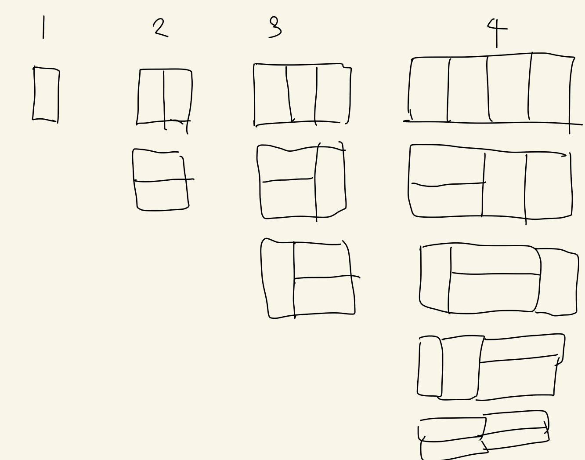

# 문제
2×n 크기의 직사각형을 1×2, 2×1 타일로 채우는 방법의 수를 구하는 프로그램을 작성하시오.

아래 그림은 2×5 크기의 직사각형을 채운 한 가지 방법의 예이다.


# 입력
첫째 줄에 n이 주어진다. (1 ≤ n ≤ 1,000)

# 출력
첫째 줄에 2×n 크기의 직사각형을 채우는 방법의 수를 10,007로 나눈 나머지를 출력한다.

```
예제 입력 1
2
예제 출력 1
2
예제 입력 2
9
예제 출력 2
55
```

# 풀이
- 접근 방법은 얼추 비슷하게 갔던 것 같은데, 결국 아이디어를 완성시키지 못했다.
  - 그림을 그릴 때 괜히 모든 칸을 분리하면서 그려서 이전 값과 연결시키지 못했다.
  - 그냥 아래 그림처럼 칸을 나누지 않고 그리면 한 눈에 보인다.
  - dp[n] = dp[n-1] + dp[n-2]
    - dp[n-1]로 구한 그림 맨 뒤에 2x1 타일을 이어 붙인다.
    - dp[n-2]로 구한 그림 맨 뒤에 1x2 타일을 2개 이어 붙인다.
    - 그럼 각자 서로 다른 타일 모양으로 끝나니까 겹치지 않게 된다.
  - 처음 풀 때, dp[n]을 구하기 위해 n보다 작은 dp[j]들을 활용하려면, 겹치는 경우를 고려하느라 어려운 문제라고 생각했는데 그게 아니었다...
- 이전에 구한 값을 활용해서 다음 값을 구하는 아이디어를 떠올리는 문제인데, 답을 알고 다시 보니까 굉장히 좋은 문제인 것 같다.
  - 마지막에 2x1 타일을 붙이려면, 1칸만 추가되면 되니까 dp[n-1]을 참고하면 되고
  - 마지막에 1x2 타일을 붙이려면, 2칸을 추가해야 되니까 dp[n-2]을 참고해야 한다.


