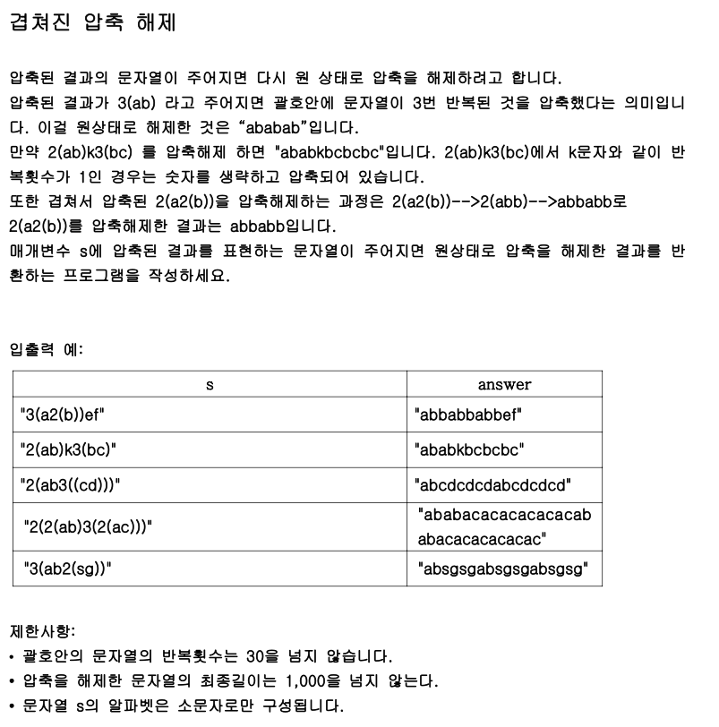

# 문제


# 풀이
- stack으로 푸는 방법까지는 구현했는데, 코드가 점점 복잡해지는게 내가 잘못 접근하고 있는 것 같아서 풀다가 포기함
  - 열린 괄호를 만났을 때, 앞에 숫자가 있는지 판단하는 로직을 정말 Integer.parseInt와 try catch로 해야하는가?
  - 숫자가 한 자릿수가 아니라 두 자릿수까지 가능해서 복잡해지는 것 같다.
- +) 강의에서 배운 내용
  - 괄호와 마찬가지로, 짝궁을 매칭시켜야하는 문제는 십중팔구 스택이다. 예를 들어 
    - 음수와 양수를 짝궁시키는 경우
    - 이웃한 문자들이 같은 경우 삭제 (abbab -> aab -> b)
    - 어떤 조건을 만족했을 때 파바박 꺼내게 되는 자료구조
  - 선형 탐색을 해나가다가, 짝궁 중 뒤에 있는 놈을 만났을 때 어떻게 대처할건지가 핵심
  - 여는 괄호를 만나면, 숫자를 만나는 동안 계속 stack.pop() <- 내가 이 처리를 제대로 구현 못해냈음.
    - 여는 괄호 이전의 값들은 아직 한 번도 합쳐지지 않고 스택에 들어간 값들이니까 무조건 한자리 char라서 가능하겠구나.
    - 아.. 더 명확히는 Character.isDigit(stack.peek().charAt(0))으로 호출하면 훨씬 명확하네...
  - 아라비아 숫자(0~9)를 판단하고 싶은거면 Character.isNumericValue()보다 Character.isDigit()이 맞구나.. 
  - while(!stack.isEmpty()) 안에 내부적으로 또 while(!stack.isEmpty())가 충분히 존재할 수 있다.

```java
import java.util.*;

class Solution {
    public String solution(String s){
        String answer = "";
        Stack<String> st = new Stack<>();
        for(Character x : s.toCharArray()){
            if(x == ')'){
                String tmp = "";
                while(!st.empty()){
                    String c = st.pop();
                    if(c.equals("(")){
                        String num = "";
                        while(!st.empty() && Character.isDigit(st.peek().charAt(0))){
                            num = st.pop() + num;
                        }
                        String res = "";
                        int cnt = 0;
                        if(num.equals("")) cnt = 1;
                        else cnt = Integer.parseInt(num);
                        for(int i = 0; i < cnt; i++) res += tmp;
                        st.push(res);
                        break;
                    }
                    tmp = c + tmp;
                }
            }
            else st.push(String.valueOf(x));
        }
        for(String x : st) answer += x;
        return answer;
    }
}

```
