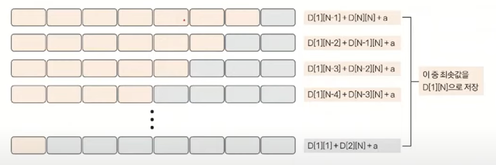

# 문제
크기가 N×M인 행렬 A와 M×K인 B를 곱할 때 필요한 곱셈 연산의 수는 총 N×M×K번이다. 행렬 N개를 곱하는데 필요한 곱셈 연산의 수는 행렬을 곱하는 순서에 따라 달라지게 된다.

예를 들어, A의 크기가 5×3이고, B의 크기가 3×2, C의 크기가 2×6인 경우에 행렬의 곱 ABC를 구하는 경우를 생각해보자.

AB를 먼저 곱하고 C를 곱하는 경우 (AB)C에 필요한 곱셈 연산의 수는 5×3×2 + 5×2×6 = 30 + 60 = 90번이다.
BC를 먼저 곱하고 A를 곱하는 경우 A(BC)에 필요한 곱셈 연산의 수는 3×2×6 + 5×3×6 = 36 + 90 = 126번이다.
같은 곱셈이지만, 곱셈을 하는 순서에 따라서 곱셈 연산의 수가 달라진다.

행렬 N개의 크기가 주어졌을 때, 모든 행렬을 곱하는데 필요한 곱셈 연산 횟수의 최솟값을 구하는 프로그램을 작성하시오. 입력으로 주어진 행렬의 순서를 바꾸면 안 된다.

# 입력
첫째 줄에 행렬의 개수 N(1 ≤ N ≤ 500)이 주어진다.

둘째 줄부터 N개 줄에는 행렬의 크기 r과 c가 주어진다. (1 ≤ r, c ≤ 500)

항상 순서대로 곱셈을 할 수 있는 크기만 입력으로 주어진다.

# 출력
첫째 줄에 입력으로 주어진 행렬을 곱하는데 필요한 곱셈 연산의 최솟값을 출력한다. 정답은 231-1 보다 작거나 같은 자연수이다. 또한, 최악의 순서로 연산해도 연산 횟수가 231-1보다 작거나 같다.
```
예제 입력 1
3
5 3
3 2
2 6
예제 출력 1
90
```

# 나의 시도
- 아래와 같은 일차원 점화식으로 풀려고 시도했으나 틀렸음.
```java
dp[i] = Math.min(dp[i - 1] + arr[0][0] * arr[i][0] * arr[i][1], dp[i - 2] + arr[i - 1][0] * arr[i][0] * arr[i][1] + arr[0][0] * arr[i - 1][0] * arr[i][1]);
```
- ABC에 D가 추가됐을 때 A(BCD), (ABC)D 이런 경우도 비교해야하나? 생각해서 dp[i][j]로 구간을 정해야하나? 까지 아이디어는 떠올렸음
  - 근데 어떤 경우에 곱셈값이 변할 수 있는거고, dp[i][j]로 한다면 어떻게 dp를 채워나갈 수 있을 지 잘 떠오르지 않아서 못품

# 유튜브 풀이
- https://www.youtube.com/watch?v=CePoVqlhi5s
- 문제가 어렵고 점화식을 구하기 막막할 때는 동적 계획법의 특징을 다시 한 번 떠올려 보세요.
  - 부분 문제를 구해 큰 문제를 해결하는 방식이 동적 계획법의 특징 중 하나입니다.
  - 따라서 부분의 문제가 해결됐다고 가정하고, 점화식을 떠올려 보는 것도 점화식을 세울 수 있는 좋은 방법 중 하나입니다.
  - 아.. 행렬 하나만 뒤에 추가돼도 아래와 같이 두 개로 토막낼 수 있는 경우는 모두 토막내서 다시 최솟값을 비교해봐야 하는게 맞구나. 이게 많이 헷갈렸음.

- 와.. 탑다운으로 dp를 풀면 재귀 + 메모이제이션으로 풀리는거구나.
  - dp[1][100]을 구하려면, min(dp[1][99] + dp[100][100] + 알파, dp[1][98] + dp[99][100] + 알파, ... , dp[1][1] + dp[2][100] + 알파)
  - 이 때 dp[1][99]는 또 아직 모르는 값이니까 재귀로 내려가고... 메모이제이션하고... 메모이제이션 된 값 있으면 재귀 뻗지 말고 그 값 바로 활용하는 식으로!
  - 특히 dp[1][1] 같이 한 개의 행렬이면 0 리턴하고, dp[1][2] 같이 2개의 행렬이면, 2개 행렬 연산 값을 리턴하면 된다. 후보가 단 하나이므로 바로 구할 수 있는 것 
  - 3개 이상일 때부터 앞서 말한 것처럼 여러가지 후보가 나올 수 있으므로 재귀 뻗으면 됨.
- 풀이 영상보고 내가 다시 직접 푼 코드
  - top-down 방식으로 재귀와 메모이제이션을 활용한 문제로서 엄청 좋은 문제인 것 같다. 풀이도 엄청 깔끔하게 나옴
  - 아래 코드를 다시 봤을 때 자연스럽게 이해되면, bottom-up으로 푸는 방식으로 다시 생각해보자.
```java
import java.util.*;

public class Main {

    static int[][] dp;
    static int[][] arr;

    public static void main(String[] args) {
        Scanner sc = new Scanner(System.in);

        int n = sc.nextInt();

        arr = new int[n + 1][2];
        for (int i = 1; i <= n; i++) {
            arr[i][0] = sc.nextInt();
            arr[i][1] = sc.nextInt();
        }

        dp = new int[n + 1][n + 1];
        for (int i = 0; i <= n; i++) {
            Arrays.fill(dp[i], Integer.MAX_VALUE);
        }

        System.out.println(recur(1, n));
    }

    static int recur(int s, int e) {
        if (dp[s][e] != Integer.MAX_VALUE) {
            return dp[s][e];
        }
        if (s == e) {
            return 0;
        }
        if (s + 1 == e) {
            return arr[s][0] * arr[e][0] * arr[e][1];
        }
        int min = Integer.MAX_VALUE;
        for (int i = 0; s + i < e; i++) {
            min = Math.min(min, recur(s, s + i) + recur(s + i + 1, e) + arr[s][0] * arr[s + i][1] * arr[e][1]);
        }
        return dp[s][e] = min; // 처음에 실수로 그냥 return min; 해서 시간초과 났음
    }
}

```

# 25.04.21 재시도
- 오랜만에 다시 풀려고 시도했는데 또 못풀었음...
- 뒤에 하나가 추가될 때마다, 2등분 낼 수 있는 모든 경우의 수에 대해 새로 계산해서 min을 구해야 한다는 아이디어가 떠올라야만 풀 수 있는데, 안 떠올랐다...
